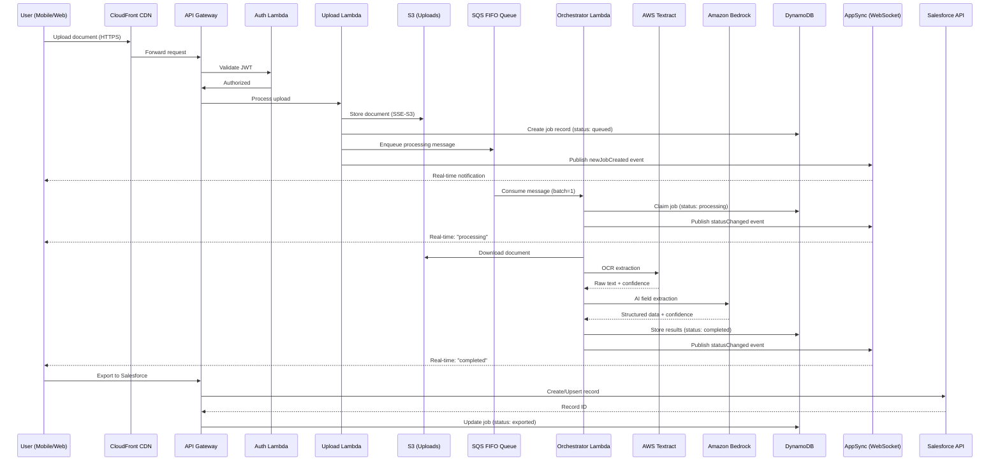

# xVio Scan -- Architecture Documentation

> **Prepared for:** Salesforce AppExchange Security Review
> **Publisher:** ExonPro Innovations LLP
> **Document Version:** 1.0
> **Date:** February 2026
> **Classification:** Confidential -- Security Review Only

---

## Table of Contents

1. [Executive Summary](#1-executive-summary)
2. [Platform Overview](#2-platform-overview)
3. [High-Level Architecture](#3-high-level-architecture)
4. [Infrastructure Components](#4-infrastructure-components)
5. [Authentication and Authorization](#5-authentication-and-authorization)
6. [Salesforce Integration Architecture](#6-salesforce-integration-architecture)
7. [Data Flow Architecture](#7-data-flow-architecture)
8. [Multi-Tenant Data Isolation](#8-multi-tenant-data-isolation)
9. [Encryption Architecture](#9-encryption-architecture)
10. [Network Security Architecture](#10-network-security-architecture)
11. [API Security](#11-api-security)
12. [Real-Time Communication](#12-real-time-communication)
13. [Job Processing Pipeline](#13-job-processing-pipeline)
14. [Data Storage and Retention](#14-data-storage-and-retention)
15. [Deployment Architecture](#15-deployment-architecture)
16. [Monitoring, Logging, and Audit](#16-monitoring-logging-and-audit)
17. [Disaster Recovery](#17-disaster-recovery)
18. [Mobile Application Security](#18-mobile-application-security)
19. [Compliance Summary](#19-compliance-summary)

---

## 1. Executive Summary

xVio Scan is an AI-powered document scanning platform that transforms handwritten notes, business cards, forms, invoices, and sketches into structured, searchable digital data. Built as a multi-tenant SaaS application on Amazon Web Services (AWS), it integrates natively with Salesforce CRM to enable one-scan-to-CRM workflows for field sales, operations, and back-office teams.

**Key architectural characteristics:**

- Fully serverless AWS architecture (Lambda, DynamoDB, API Gateway, CloudFront)
- Multi-tenant with strict data isolation at the database partition level
- Salesforce OAuth 2.0 + PKCE as the primary authentication mechanism
- End-to-end encryption (TLS 1.2+ in transit, AES-256 at rest)
- Infrastructure as Code via AWS CDK (TypeScript)
- No customer data stored outside AWS `ap-south-1` region

**Listing type:** API Connector (external web application integrated with Salesforce via OAuth 2.0 and REST API)

---

## 2. Platform Overview

| Attribute | Value |
|-----------|-------|
| Product Name | xVio Scan |
| Publisher | ExonPro Innovations LLP |
| Listing Type | API Connector |
| Cloud Provider | Amazon Web Services (AWS) |
| Primary Region | `ap-south-1` (Mumbai, India) |
| Architecture Style | Serverless, event-driven, multi-tenant SaaS |
| Runtime | Node.js 20 (TypeScript) on AWS Lambda |
| Database | Amazon DynamoDB (single-table design) |
| Frontend | SvelteKit 2.0 (Web), Capacitor 6.x (iOS/Android) |
| Infrastructure as Code | AWS CDK (TypeScript), 5 CloudFormation stacks |

### Platform Availability

| Platform | Technology | Distribution |
|----------|-----------|-------------|
| Web | SvelteKit 2.0 (Progressive Web App) | `scan.xvio.ai` |
| iOS | SvelteKit + Capacitor 6.2 | App Store |
| Android | SvelteKit + Capacitor 6.0 | Google Play |

---

## 3. High-Level Architecture

```
                         Salesforce Org
                        (Connected App)
                              |
                     OAuth 2.0 + PKCE
                              |
    +-------------------------+-------------------------+
    |                                                   |
    v                                                   v
+--------+   HTTPS    +------------+   HTTPS    +------------+
| Mobile |----------->| CloudFront |----------->| CloudFront |
| App    |  (iOS/    | (Tenant    |  (API      | (API       |
| (Web)  |  Android) |  App CDN)  |  CDN)      |  WAF)      |
+--------+            +------------+            +-----+------+
                                                      |
                                               +------v-------+
                                               | API Gateway   |
                                               | (REST, v1)    |
                                               | WAF Protected  |
                                               +------+--------+
                                                      |
                              +-----------+-----------+-----------+
                              |           |           |           |
                         +----v---+  +----v---+  +----v---+  +----v---+
                         | Lambda |  | Lambda |  | Lambda |  | Lambda |
                         | Auth   |  | Jobs   |  | Admin  |  | Export |
                         +----+---+  +----+---+  +----+---+  +----+---+
                              |           |           |           |
                         +----v-----------v-----------v-----------v----+
                         |         DynamoDB (Single Table)             |
                         |       PK: TENANT#{id}#APP#{id}#...         |
                         +----+----------------+----------------+------+
                              |                |                |
                        +-----v-----+    +-----v-----+   +-----v------+
                        |    S3     |    |    SQS    |   |  AppSync   |
                        | (Uploads, |    |  (FIFO    |   | (GraphQL   |
                        |  Exports, |    |   Job     |   |  Real-time |
                        |  Static)  |    |   Queue)  |   |  WebSocket)|
                        +-----------+    +-----+-----+   +------------+
                                               |
                                         +-----v------+
                                         | Lambda     |
                                         | Orchestrator|
                                         +-----+------+
                                               |
                                    +----------+----------+
                                    |                     |
                              +-----v------+       +------v-----+
                              |  Textract  |       |  Bedrock   |
                              |  (OCR)     |       |  (LLM AI)  |
                              +------------+       +------+-----+
                                                         |
                                                   +-----v------+
                                                   | Salesforce  |
                                                   | REST API    |
                                                   | (Export)    |
                                                   +-------------+
```

---

## 4. Infrastructure Components

### 4.1 CloudFormation Stack Organization

xVio Scan is deployed across 5 independent CloudFormation stacks, each managing a distinct concern:

| Stack | Purpose | Key Resources |
|-------|---------|---------------|
| **SharedStack** | Shared data infrastructure | DynamoDB tables, S3 buckets, SQS queues, SNS topics, Cognito User Pools |
| **BackendStack** | REST API and compute | API Gateway, 40+ Lambda handlers, API CloudFront distribution, WAF |
| **BackendExtStack** | API route extensions | Additional Lambda handlers and API routes (overflow from 500-resource limit) |
| **FrontendStack** | Static web hosting | Tenant app CloudFront distribution, Admin console CloudFront, S3 static hosting |
| **AppSyncStack** | Real-time communication | GraphQL API, WebSocket subscriptions, Lambda authorizer |

### 4.2 AWS Services Used

| Service | Purpose | Configuration |
|---------|---------|---------------|
| **AWS Lambda** | Compute (all business logic) | Node.js 20, ARM64, TypeScript |
| **Amazon DynamoDB** | Primary database | Single-table design, on-demand capacity, PITR enabled |
| **Amazon API Gateway** | REST API endpoint | v1 REST API, stage throttling, Cognito + JWT auth |
| **Amazon CloudFront** | CDN and TLS termination | 3 distributions (API, Tenant App, Admin Console) |
| **AWS WAF v2** | Web Application Firewall | Managed rules + rate limiting |
| **Amazon S3** | Object storage | Uploads, exports, feedback, frontend static assets |
| **Amazon SQS** | Async job processing | FIFO queue, batch=1, maxConcurrency=10 |
| **AWS AppSync** | Real-time GraphQL | WebSocket subscriptions, Lambda authorizer |
| **Amazon Cognito** | Admin authentication | User pools for admin console access |
| **AWS Secrets Manager** | Secret storage | JWT private keys, Salesforce credentials |
| **AWS SSM Parameter Store** | Configuration | JWT public keys |
| **Amazon Textract** | OCR processing | Sync + async document analysis |
| **Amazon Bedrock** | AI/LLM inference | Converse API, multiple model support |
| **Amazon SES** | Transactional email | Feedback acknowledgments, scan notifications |
| **AWS Certificate Manager** | TLS certificates | Wildcard certs for multi-tenant subdomains |
| **Amazon Route 53** | DNS management | Wildcard DNS for tenant subdomains |
| **AWS CloudWatch** | Monitoring and logging | Structured JSON logging, alarms |
| **AWS CloudTrail** | API audit trail | All AWS API call auditing |
| **AWS CDK** | Infrastructure as Code | TypeScript, declarative stack definitions |

---

## 5. Authentication and Authorization

### 5.1 Authentication Methods

xVio Scan supports multiple authentication methods. For AppExchange tenants, Salesforce OAuth 2.0 is the primary method:

| Method | Use Case | Protocol |
|--------|----------|----------|
| **Salesforce OAuth 2.0 + PKCE** | Primary tenant user login | OAuth 2.0 Authorization Code + PKCE (RFC 7636) |
| **Cognito Direct** | Standalone tenants (no Salesforce) | Email/password via AWS Cognito |
| **API Key Exchange** | Server-to-server programmatic access | API key exchanged for scoped JWT |
| **Mobile Code Exchange** | Deep link authentication | One-time 60-second exchange codes |

### 5.2 JWT Token Architecture

All authenticated sessions use JWT tokens issued and verified by xVio Scan:

| Attribute | Value |
|-----------|-------|
| Algorithm | RS256 (asymmetric RSA) |
| Issuer | `api.xvio.ai` |
| Audience | `xvio-api` (production), `xvio-api-sandbox` (sandbox detection) |
| Access Token Expiry | Per-tenant configurable (default 24 hours) |
| Refresh Token Validity | Per-tenant configurable (default 30 days) |
| Session Duration | Per-tenant configurable (default 180 days) |
| Private Key Storage | AWS Secrets Manager (Lambda-cached, 5-min TTL) |
| Public Key Storage | AWS SSM Parameter Store |
| Token Claims | `sub`, `email`, `tenantId`, `type`, `scopes` |
| Token Types | `tenant_user` (user tokens), `api_key` (programmatic) |

### 5.3 Scope-Based Authorization

Every API request is authorized via `authorizeTenantRequest(event, tenantId, userId, requiredScope)`:

| Token Type | Scopes | Access Level |
|------------|--------|-------------|
| User tokens (OAuth) | Full access | All tenant operations |
| API key tokens | Scoped: `jobs:read`, `jobs:write`, `*` | Limited to granted scopes |

### 5.4 CSRF Protection

| Control | Implementation |
|---------|---------------|
| State parameter | `crypto.getRandomValues()` (32 bytes, cryptographically random) |
| Storage | Single-use `sessionStorage` (cleared after verification) |
| Validation | State mismatch throws "possible CSRF attack" error |

---

## 6. Salesforce Integration Architecture

### 6.1 OAuth 2.0 + PKCE Flow

```
+------------------+      +------------------+      +------------------+
|   xVio Scan      |      |   xVio API       |      |   Salesforce     |
|   (Mobile/Web)   |      |   (Lambda)       |      |   Org            |
+--------+---------+      +--------+---------+      +--------+---------+
         |                         |                          |
    1.   |--- POST /login -------->|                          |
         |                         |-- Validate tenant ------>|
         |                         |-- Generate PKCE -------->|
         |                         |-- Store verifier ------->| (DynamoDB, 10-min TTL)
         |<-- OAuth URL -----------|                          |
         |                         |                          |
    2.   |--- Redirect (browser) ---------------------------------->|
         |                         |                          |-- Check Permission Set
         |                         |                          |-- User authenticates
         |                         |                          |-- User authorizes app
         |<-- code + state ----------------------------------------|
         |                         |                          |
    3.   |--- GET /callback ------>|                          |
         |                         |-- Retrieve verifier ---->| (DynamoDB)
         |                         |-- Exchange code -------->| (code + verifier + secret)
         |                         |<-- SF tokens ------------|
         |                         |-- GET /userinfo -------->|
         |                         |<-- user info ------------|
         |                         |                          |
    4.   |                         |-- Validate org_id ------>|
         |                         |-- Encrypt SF tokens ---->| (AES-256-GCM)
         |                         |-- Store in DynamoDB ---->|
         |                         |-- Generate JWT --------->| (RS256)
         |                         |                          |
    5.   |<-- JWT + refresh token --|                          |
```

### 6.2 Connected App Configuration

| Setting | Value |
|---------|-------|
| OAuth Grant Type | Authorization Code with PKCE (RFC 7636) |
| OAuth Scopes | `api` (REST API access), `refresh_token` (offline access) |
| Callback URL | `https://api-{stage}.xvio.ai/v1/tenant/auth/callback` |
| PKCE Method | S256 (SHA-256 code challenge) |

### 6.3 Salesforce Credential Storage

| Item | Storage Location | Encryption |
|------|-----------------|------------|
| Consumer Key + Secret | AWS Secrets Manager (`xvio/{stage}/tenant/{tenantId}/salesforce`) | AWS KMS (Secrets Manager default) |
| User OAuth Access Token | DynamoDB (per-user record) | AES-256-GCM field-level encryption |
| User OAuth Refresh Token | DynamoDB (per-user record) | AES-256-GCM field-level encryption |
| User Instance URL | DynamoDB (per-user record) | AES-256-GCM field-level encryption |

Credentials are never logged, never returned in API responses unmasked (values displayed as `3MVG9...***`), and are cached in Lambda memory for a maximum of 5 minutes.

### 6.4 Organization ID Validation

After Salesforce authenticates the user, xVio Scan performs a second validation layer:

```
Salesforce userinfo response: organization_id = "00Dff000000H78LEAS"
Tenant configuration:         authConfig.salesforce.orgId = "00Dff000000H78LEAS"

IF configured orgId != user's organization_id:
    -> ACCESS DENIED
    -> Audit log: AUTH_LOGIN_FAILURE (reason: org_id_mismatch)
    -> Error returned to user
```

This prevents users from other Salesforce organizations from accessing a tenant's data, even if they possess valid Salesforce credentials.

### 6.5 Salesforce Admin Access Controls

The Salesforce organization administrator retains full control over xVio Scan access:

| Control | Mechanism | Effect |
|---------|-----------|--------|
| Connected App Policies | Setup > App Manager | OAuth scopes, IP restrictions, session timeout |
| Permission Set Assignment | Setup > Permission Sets | Control which users can authorize the app |
| Profile Restrictions | Connected App settings | Restrict by user profile |
| IP Restrictions | Org or Connected App settings | Block OAuth from untrusted networks |
| Session Policies | Setup > Session Settings | Control session duration and timeout |
| Login Hours | Profile settings | Restrict login to specific time windows |
| Consumer Secret Rotation | App Manager > Manage | Quarterly rotation recommended |
| Connected App Revocation | App Manager > Manage | Instantly revoke all user access |
| User Deactivation | User management | Immediately blocks xVio access |

### 6.6 Salesforce Data Export Flow

```
Scan Completed (AI extraction done)
    |
    v
Field Mapping Applied
    (extractedData fields -> Salesforce object fields)
    |
    v
OAuth Token Retrieved + Decrypted
    (AES-256-GCM decryption from DynamoDB)
    |
    v
Token Refresh (if expired)
    (Automatic refresh via Salesforce refresh_token grant)
    |
    v
Salesforce REST API Call
    (Create or Upsert operation)
    |
    v
Record ID Stored in Job Record
    (Salesforce record ID saved for reference)
    |
    v
Job Status Updated to "exported"
```

**Supported Salesforce objects:** Leads, Contacts, Accounts, Opportunities, Cases, Custom Objects

**Operations:** Create, Upsert (with configurable external ID), Duplicate detection

---

## 7. Data Flow Architecture

### 7.1 End-to-End Document Processing Flow



### 7.2 Data at Each Stage

| Stage | Data In | Data Out | Storage |
|-------|---------|----------|---------|
| Upload | Image/PDF (max 50MB) | S3 key, Job record | S3 (encrypted), DynamoDB |
| OCR (Textract) | Document image | Raw text lines, confidence | Transient (Lambda memory) |
| AI Extraction (Bedrock) | Raw text, prompt template | Structured fields, confidence | Transient (Lambda memory) |
| Result Storage | Structured data | Job record with extractedData | DynamoDB (encrypted) |
| Export | Structured data | Salesforce record ID | DynamoDB (reference stored) |

### 7.3 Network Boundaries

All data flows occur over encrypted channels:

```
User Device                  AWS Cloud (ap-south-1)              Salesforce
+-----------+    TLS 1.2+   +---------------------------+   TLS 1.2+   +----------+
| Browser / |<------------>| CloudFront                 |<------------>| SF API   |
| Mobile App|              |   API Gateway              |              +----------+
+-----------+              |     Lambda functions        |
                           |       DynamoDB              |
                           |       S3                    |
                           |       SQS                   |
                           +---------------------------+
                           All internal AWS traffic uses
                           VPC endpoints or AWS backbone
```

---

## 8. Multi-Tenant Data Isolation

### 8.1 DynamoDB Partition-Level Isolation

xVio Scan uses a single DynamoDB table with composite keys that enforce tenant isolation at the partition level:

```
Partition Key (PK):  TENANT#{tenantId}#APP#{appId}#USER#{userId}
Sort Key (SK):       JOB#{createdAt}#{jobId}
```

**Isolation guarantees:**

- Every partition key includes `tenantId` -- cross-tenant queries are structurally impossible
- All queries scope by `tenantId` + `appId` before execution
- App-scoped entities use `TENANT#{tid}#APP#{aid}` prefix, preventing cross-app data access
- No Global Secondary Index permits cross-tenant scans
- All queries validate tenant membership and app subscription before data access

### 8.2 Tenant Isolation Diagram

```
DynamoDB Single Table
+-----------------------------------------------------------------------+
|                                                                       |
|  Tenant A (TENANT#aaa)              Tenant B (TENANT#bbb)            |
|  +-------------------------------+  +-------------------------------+ |
|  | PK: TENANT#aaa#APP#scan#USER1 |  | PK: TENANT#bbb#APP#scan#USER5| |
|  |   SK: JOB#2026-02-01#job-001  |  |   SK: JOB#2026-02-01#job-010 | |
|  |   SK: JOB#2026-02-02#job-002  |  |   SK: JOB#2026-02-02#job-011 | |
|  |                               |  |                               | |
|  | PK: TENANT#aaa#APP#scan#USER2 |  | PK: TENANT#bbb#APP#scan#USER6| |
|  |   SK: JOB#2026-02-03#job-003  |  |   SK: JOB#2026-02-03#job-012 | |
|  +-------------------------------+  +-------------------------------+ |
|                                                                       |
|  Tenant A CANNOT query Tenant B's partition keys.                     |
|  JWT token contains tenantId; all queries filter by it.               |
+-----------------------------------------------------------------------+
```

### 8.3 S3 File Isolation

Uploaded files are stored under tenant-scoped S3 key prefixes:

```
s3://uploads-bucket/
  tenants/
    {tenantId}/
      {appId}/
        {userId}/
          {jobId}/{filename}
```

- Server-side encryption: SSE-S3 (AES-256)
- Access controlled via Lambda IAM roles (no direct user access to S3)
- Optional `deleteSourceAfterProcessing` flag removes source files after AI extraction

### 8.4 Quota Isolation

| Tier | Quota Type | Tracking |
|------|-----------|----------|
| Paid | Monthly per-service | Sharded across 10 DynamoDB partitions (`SHARD#0` through `SHARD#9`) |
| Free | Lifetime per-user | Single DynamoDB record per user |

Shard assignment: `hash(userId) % 10` for even write distribution.

---

## 9. Encryption Architecture

### 9.1 Encryption at Rest

| Resource | Encryption Method | Key Management |
|----------|------------------|----------------|
| DynamoDB tables | AWS-managed encryption (AES-256) | AWS managed |
| S3 buckets | SSE-S3 (AES-256) | AWS managed |
| Salesforce OAuth tokens | AES-256-GCM (field-level) | Application-managed encryption key |
| Integration credentials | AES-256-GCM (field-level) | Application-managed encryption key |
| JWT private keys | AWS Secrets Manager | AWS KMS |
| Salesforce Consumer Key/Secret | AWS Secrets Manager | AWS KMS |

### 9.2 Encryption in Transit

| Channel | Protocol | Minimum Version |
|---------|----------|----------------|
| API calls (user to CloudFront) | TLS | 1.2 |
| CloudFront to API Gateway | TLS | 1.2 |
| WebSocket (AppSync) | WSS (TLS) | 1.2 |
| OAuth flows (to Salesforce) | HTTPS | 1.2 |
| S3 uploads (presigned URLs) | HTTPS | 1.2 |
| Internal AWS service calls | HTTPS | 1.2 |

### 9.3 Field-Level Encryption for OAuth Tokens

Salesforce user tokens are encrypted before storage in DynamoDB using AES-256-GCM:

```
+---------------------+     +------------------+     +------------------+
| Salesforce Tokens    |     | AES-256-GCM      |     | DynamoDB         |
| (access, refresh,    |---->| Encryption with   |---->| Encrypted fields |
|  instanceUrl)        |     | unique IV per     |     | + encryption     |
|                      |     | encryption op     |     |   version (v1)   |
+---------------------+     +------------------+     +------------------+
```

The encryption version field (`v1`) supports future key rotation without breaking existing records.

---

## 10. Network Security Architecture

### 10.1 WAF Configuration (AWS WAF v2)

WAF is enabled on API Gateway in preprod and production environments:

| Rule | Description | Action |
|------|-------------|--------|
| **Rate Limiting** | 2,000 req/5min (dev), 3,000 req/5min (prod) per IP | Block |
| **AWS Common Rules** | OWASP Top 10 protections (XSS, path traversal, etc.) | Block |
| **Known Bad Inputs** | Block known malicious request patterns | Block |
| **SQL Injection Rules** | SQLi detection and blocking | Block |
| **IP Reputation List** | Block requests from known malicious IPs | Block |
| **Geo-Blocking** | Optional country-level restriction | Block (configurable) |

Custom blocked response returns structured JSON (no stack traces or internal details):

```json
{
  "success": false,
  "error": {
    "code": "BLOCKED_BY_WAF",
    "message": "Request blocked by security policy"
  }
}
```

### 10.2 CloudFront Security

| Control | Configuration |
|---------|---------------|
| HTTPS enforcement | Viewer protocol: redirect HTTP to HTTPS |
| TLS minimum version | TLSv1.2_2021 |
| Security headers (HSTS) | `Strict-Transport-Security: max-age=31536000; includeSubDomains` |
| X-Content-Type-Options | `nosniff` |
| X-Frame-Options | `DENY` |
| X-XSS-Protection | `1; mode=block` |
| Referrer-Policy | `strict-origin-when-cross-origin` |
| Permissions-Policy | `camera=(), microphone=(), geolocation=()` |

### 10.3 Network Flow Diagram

```
                           Internet
                              |
                     +--------v---------+
                     | AWS CloudFront   |
                     | (Edge Locations) |
                     | - TLS 1.2+      |
                     | - Security Hdrs  |
                     | - CORS Function  |
                     +--------+---------+
                              |
                     +--------v---------+
                     | AWS WAF v2       |
                     | - Rate limiting  |
                     | - OWASP rules   |
                     | - IP reputation  |
                     | - SQLi rules    |
                     +--------+---------+
                              |
                     +--------v---------+
                     | API Gateway      |
                     | - Stage throttle |
                     |   1000 req/min   |
                     |   500 burst      |
                     | - Request valid. |
                     +--------+---------+
                              |
                     +--------v---------+
                     | Lambda           |
                     | - JWT validation |
                     | - Zod input val. |
                     | - Tenant auth    |
                     | - Rate limiting  |
                     +------------------+
```

---

## 11. API Security

### 11.1 API Gateway Configuration

| Setting | Value |
|---------|-------|
| API Type | REST (v1) |
| Stage | `v1` |
| Stage Throttling | 1,000 requests/second, 500 burst |
| Authorization (Admin routes) | Cognito User Pool Authorizer |
| Authorization (Tenant routes) | Lambda JWT Authorizer |
| Payload Limit | 10 MB (API Gateway), 6 MB (Lambda proxy) |
| Binary Media Types | Supported for file uploads |

### 11.2 Input Validation

All API inputs are validated using Zod schemas before processing:

| Validation Layer | Method | Scope |
|-----------------|--------|-------|
| Schema validation | Zod (TypeScript) | All handler inputs |
| Pipeline config validation | Per-stage type checking | AI pipeline definitions |
| File type validation | MIME type detection | Upload handlers |
| File size validation | Content-Length check | 20MB (base64), 50MB (presigned) |
| URL validation | Allowlist matching | OAuth redirect URIs |
| Text sanitization | `sanitizeText()` function | All user-supplied text fields |

### 11.3 Rate Limiting (Defense in Depth)

| Layer | Mechanism | Limit |
|-------|-----------|-------|
| CloudFront / WAF | Per-IP rate limiting | 2,000-3,000 req / 5 min |
| API Gateway | Stage throttling | 1,000 req/sec, 500 burst |
| Lambda (auth endpoints) | DynamoDB-based per-IP tracking | Configurable per endpoint |
| Lambda (upload endpoints) | Per-tenant rate limiting | Configurable per tenant |

### 11.4 Error Response Security

All API error responses follow a consistent structure that never exposes internal details:

```json
{
  "success": false,
  "error": {
    "code": "VALIDATION_ERROR",
    "message": "Human-readable error description"
  }
}
```

- No stack traces in any environment
- No internal service names or AWS resource identifiers
- No database query details
- Correlation IDs returned via `X-Correlation-ID` header for support tracing

---

## 12. Real-Time Communication

### 12.1 AppSync GraphQL (WebSocket)

| Attribute | Value |
|-----------|-------|
| Service | AWS AppSync |
| Protocol | WebSocket Secure (WSS) |
| Default Auth | Lambda authorizer (JWT validation) |
| Additional Auth | IAM (backend Lambda mutations), API_KEY (dev only) |
| Auth Cache TTL | 5 minutes |

### 12.2 Subscription Events

| Event | Trigger | Data |
|-------|---------|------|
| `onScanStatusUpdate` | Job status transitions | jobId, status, confidence, timestamps |
| `onNewJob` | New scan uploaded | jobId, serviceName, status |
| `onJobDeleted` | Job deleted | jobId, tenantId |
| `onQuotaUpdate` | Quota usage changes | serviceId, used, limit |
| `onConfigUpdate` | Tenant config/branding changes | configType, version |

### 12.3 Subscription Security

- All subscriptions require valid JWT (Lambda authorizer validates before registration)
- Subscriptions filter by `tenantId`, `appId`, and `userId` -- users only receive their own events
- Backend publishes mutations via IAM (SigV4 signing) -- no user-facing mutation access
- WebSocket keep-alive at 60-second intervals
- Auto-reconnection with exponential backoff (max 5 attempts)
- Graceful fallback to HTTP polling if WebSocket is unavailable

---

## 13. Job Processing Pipeline

### 13.1 SQS Job Queue

| Setting | Value |
|---------|-------|
| Queue Type | FIFO (per tenant+user ordering) |
| Batch Size | 1 message per Lambda invocation |
| Max Concurrency | 10 concurrent Lambda consumers |
| Visibility Timeout | 6x Lambda timeout |
| Dead Letter Queue | Failed messages after 3 retries |
| Idempotency | Checked before processing (skip if already processing/completed) |

### 13.2 Processing Pipeline Architecture

```
SQS Message Received
    |
    v
Idempotency Check (DynamoDB)
    |-- Already processing/completed? -> Skip
    |
    v
Claim Job (status: "processing")
    |
    v
Download File from S3
    |
    v
Execute Pipeline Stages (sequential)
    |
    +-- Stage 1: Textract (OCR)
    |     Config: AnalyzeDocument, FORMS+TABLES
    |     Output: rawTextLines[], confidence
    |     Auto-delegates PDFs to async Textract
    |
    +-- Stage 2: Bedrock (LLM)
    |     Config: model, promptTemplate, expectedFields
    |     Output: extractedData{}, confidence
    |     Multi-page chunking support
    |
    +-- Stage N: (Lambda, AgentCore, etc.)
    |
    v
Store Results in DynamoDB
    (extractedData, confidence, processingLogs)
    |
    v
Publish AppSync Mutation (real-time update)
    |
    v
Auto-Export (if configured)
    |-- Salesforce / Zoho / Email / Webhook
    |
    v
Cleanup
    |-- Queue S3 file deletion (if deleteSourceAfterProcessing=true)
```

### 13.3 AI Services Used

| Service | Purpose | Data Handling |
|---------|---------|---------------|
| AWS Textract | OCR text extraction | Document processed in-region; no data retention by AWS |
| Amazon Bedrock | LLM field extraction | Prompt + text processed in-region; no training on customer data |

Both services operate within the `ap-south-1` region. Amazon Bedrock does not use customer data to train models.

---

## 14. Data Storage and Retention

### 14.1 DynamoDB Data Model

| Entity | Partition Key Pattern | Purpose |
|--------|----------------------|---------|
| Tenant | `TENANT#{tenantId}` | Tenant metadata, configuration |
| User | `TENANT#{tenantId}#USER#{userId}` | User profile, OAuth tokens |
| Job (Scan) | `TENANT#{tenantId}#APP#{appId}#USER#{userId}` | Scan records, extracted data |
| Service | `TENANT#{tenantId}#APP#{appId}` | Processing pipeline definitions |
| Quota | `TENANT#{tenantId}#APP#{appId}#QUOTA#{YYYY-MM}#SHARD#{0-9}` | Usage tracking (sharded) |
| API Key | `TENANT#{tenantId}` (separate table) | Hashed API keys, scopes |

### 14.2 Data Retention Policies

| Data Type | Retention | Mechanism |
|-----------|-----------|-----------|
| Scan records | Indefinite (tenant-controlled) | Manual deletion or TTL |
| Source documents (S3) | Configurable per service | `deleteSourceAfterProcessing` flag |
| Diagnostic/processing logs | Configurable per service (default 30 days) | DynamoDB TTL auto-deletion |
| OAuth PKCE verifiers | 10 minutes | DynamoDB TTL |
| Lambda logs | 7 days (dev), 365 days (prod) | CloudWatch log retention |
| CloudFront access logs | Standard retention | S3 lifecycle rules |

### 14.3 Data Deletion

| Trigger | Scope | Method |
|---------|-------|--------|
| `deleteSourceAfterProcessing` | Source file in S3 | Async SQS-driven S3 deletion after processing |
| DynamoDB TTL | Expired records | Automatic TTL-based deletion |
| User logout | Client-side data | `clearAllData()` clears auth tokens, IndexedDB, localStorage |
| Tenant deactivation | All tenant data | Admin-initiated (manual process) |

---

## 15. Deployment Architecture

### 15.1 Environments

| Environment | AWS Account | Region | Stage Identifier | WAF Enabled | PITR |
|-------------|-------------|--------|-----------------|-------------|------|
| Developer | 412706839343 | ap-south-1 | `developer` | No | Yes |
| Preprod | 733459310978 | ap-south-1 | `preprod` | Yes | Yes |
| Production | 313500367588 | ap-south-1 | `production` | Yes | Yes |

### 15.2 Domain Architecture

| Service | Developer | Preprod | Production |
|---------|-----------|---------|------------|
| Scan App | `scan-dev.xvio.ai` | `scan-stage.xvio.ai` | `scan.xvio.ai` |
| Tenant Subdomains | `*.scan-dev.xvio.ai` | `*.scan-stage.xvio.ai` | `*.scan.xvio.ai` |
| API | `api-dev.xvio.ai` | `api-stage.xvio.ai` | `api.xvio.ai` |
| Admin Console | `console-dev.xvio.ai` | `console-stage.xvio.ai` | `console.xvio.ai` |

### 15.3 Deployment Pipeline

```
Developer (Direct CLI)
    AWS CDK deploy via AWS profile
    Manual deployment for rapid iteration

Preprod / Production (CI/CD)
    GitHub Actions triggered by branch push
    Automated build, test, deploy
    Stack deployment order enforced
```

### 15.4 Infrastructure as Code

All infrastructure is defined declaratively using AWS CDK (TypeScript):

- No manual resource creation in AWS Console
- All configuration in `environments.ts`
- CloudFormation change sets reviewed before deployment
- Stack dependency ordering enforced

---

## 16. Monitoring, Logging, and Audit

### 16.1 CloudWatch Monitoring

| Metric | Alarm Threshold | Action |
|--------|----------------|--------|
| Lambda errors | > 0 in 5 minutes | SNS alert |
| API 5xx responses | > 5 in 5 minutes | SNS alert |
| DynamoDB throttles | > 0 in 5 minutes | SNS alert |
| SQS DLQ messages | > 0 | SNS alert |

### 16.2 Structured Logging

All Lambda handlers emit structured JSON logs with:

| Field | Description |
|-------|-------------|
| `correlationId` | `X-Correlation-ID` from request header |
| `tenantId` | Current tenant context |
| `userId` | Current user context |
| `action` | Operation being performed |
| `duration` | Execution time in milliseconds |
| `sourceIP` | Requester IP address |

### 16.3 Log Retention

| Environment | Retention Period |
|-------------|-----------------|
| Developer | 7 days |
| Preprod | 14 days |
| Production | 365 days |

### 16.4 Audit Trail

| Event Category | Logged Fields |
|---------------|---------------|
| `AUTH_LOGIN_SUCCESS` | tenantId, userId, provider, organizationId, sourceIP |
| `AUTH_LOGIN_FAILURE` | tenantId, reason (e.g., `org_id_mismatch`, `token_exchange_failed`), sourceIP |
| `CREDENTIAL_UPDATE` | tenantId, adminUserId, action |
| `CREDENTIAL_DELETE` | tenantId, adminUserId, action |
| Data mutations | action, user, resource type, IP, correlation ID |

All authentication events, credential changes, and data mutations are logged for compliance and forensic review.

### 16.5 AWS CloudTrail

AWS CloudTrail is enabled for all AWS API call auditing across all environments, providing a complete trail of infrastructure-level operations.

---

## 17. Disaster Recovery

### 17.1 Recovery Objectives

| Metric | Target |
|--------|--------|
| RTO (Recovery Time Objective) | 4 hours |
| RPO (Recovery Point Objective) | 1 hour |

### 17.2 Backup Strategy

| Resource | Strategy | Retention |
|----------|----------|-----------|
| DynamoDB | Point-in-Time Recovery (PITR) | 35 days, per-second granularity |
| DynamoDB | On-demand backups before major migrations | Manual retention |
| S3 | Versioning enabled on critical buckets | Standard S3 lifecycle |
| Secrets Manager | Automatic versioning | AWS managed |
| Infrastructure | Full IaC (CDK) in Git -- can recreate from code | Unlimited (Git history) |

### 17.3 Recovery Procedure

1. Identify point-in-time to restore
2. Create new DynamoDB table from PITR backup
3. Update Lambda environment variables to reference new table
4. Verify data integrity
5. Switch traffic via DNS/CloudFront origin update

---

## 18. Mobile Application Security

### 18.1 Secure Token Storage

| Platform | Storage Method | Protection |
|----------|---------------|-----------|
| iOS | Capacitor Preferences | OS-level encryption (Keychain-backed) |
| Android | Capacitor Preferences | OS-level encryption (EncryptedSharedPreferences) |
| Web | localStorage | HTTPS-only origin, cleared on logout |

### 18.2 Platform-Specific OAuth

| Platform | Browser Method | Security Benefit |
|----------|---------------|-----------------|
| iOS | ASWebAuthenticationSession | In-app modal, prevents redirect hijacking |
| Android | Chrome Custom Tabs | OS-managed browser session, isolated from app |
| Web | Direct redirect | Standard browser security model |

### 18.3 Deep Link Security

- `xvio://` scheme validated against registered patterns
- One-time 60-second exchange codes for mobile deep links
- Callback URLs validated against allowlisted patterns

### 18.4 Offline Data Security

- IndexedDB stores local pending scans and sync cache
- IndexedDB access restricted to same-origin policy
- Sensitive tokens (JWT, refresh) are NOT stored in IndexedDB
- All offline data cleared on logout (`clearAllData()`)
- Passwords are never stored locally

---

## 19. Compliance Summary

### 19.1 Security Controls Matrix

| Control Area | Implementation |
|-------------|---------------|
| **Authentication** | Salesforce OAuth 2.0 + PKCE (RFC 7636), Cognito, JWT RS256 |
| **Authorization** | Per-request JWT validation, scope-based access control |
| **Data Isolation** | DynamoDB partition-key tenant isolation, S3 prefix isolation |
| **Encryption at Rest** | AES-256 (DynamoDB, S3), AES-256-GCM (field-level for tokens) |
| **Encryption in Transit** | TLS 1.2+ on all channels |
| **Input Validation** | Zod schema validation on all inputs, text sanitization |
| **Rate Limiting** | WAF (per-IP), API Gateway (stage), Lambda (per-tenant/per-IP) |
| **WAF Protection** | OWASP Top 10, SQLi, IP reputation, Known Bad Inputs |
| **Security Headers** | HSTS, X-Content-Type-Options, X-Frame-Options, X-XSS-Protection, Referrer-Policy, Permissions-Policy |
| **CSRF Protection** | Cryptographic state parameter, single-use sessionStorage |
| **Audit Logging** | All auth events, data mutations, credential changes |
| **Secret Management** | AWS Secrets Manager (KMS-encrypted), no secrets in code/env vars |
| **Backup & Recovery** | DynamoDB PITR (35-day, 1-hour RPO), IaC reproducibility |
| **Error Handling** | No stack traces, no internal details in error responses |
| **Data Minimization** | `deleteSourceAfterProcessing`, configurable log retention, TTL auto-deletion |

### 19.2 AppExchange Security Review Coverage

| Review Area | xVio Scan Coverage |
|------------|-------------------|
| Penetration testing (API/CloudFront endpoints) | WAF + rate limiting + input validation |
| SSL/TLS scan (all endpoints) | TLS 1.2+ enforced, HSTS enabled |
| OWASP Top 10 | WAF managed rules + Zod validation + sanitization |
| OAuth flow review | PKCE, state parameter, token encryption, org_id validation |
| Mobile app security | Platform-native OAuth browsers, secure storage, deep link validation |
| Architecture documentation | This document |
| Error response review | Structured JSON errors, no sensitive data leakage |

---

*Copyright 2026 ExonPro Innovations LLP. All Rights Reserved.*
*This document is confidential and intended solely for Salesforce AppExchange security review purposes.*
