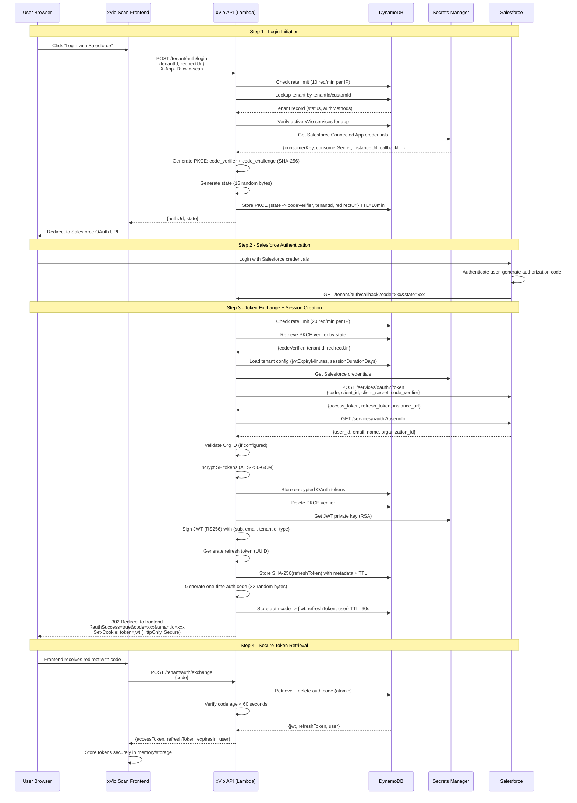
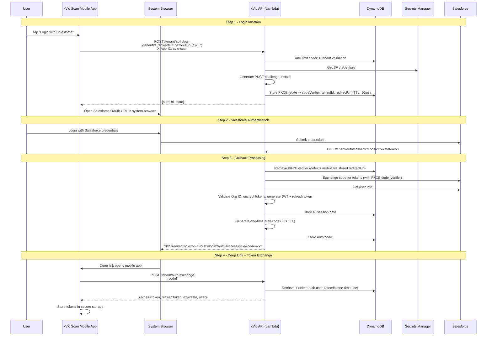
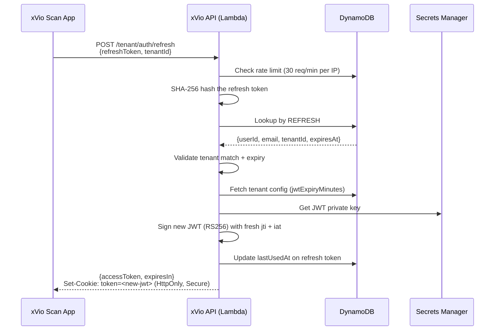

# xVio Scan - OAuth 2.0 Authentication Flow

**Product:** xVio Scan by ExonPro Innovations LLP
**Document Type:** Security Architecture - Authentication Flow
**Audience:** Salesforce AppExchange Security Review
**Last Updated:** 2026-02-24

---

## Table of Contents

1. [Overview](#overview)
2. [Architecture Summary](#architecture-summary)
3. [Authentication Endpoints](#authentication-endpoints)
4. [Salesforce OAuth 2.0 + PKCE Flow](#salesforce-oauth-20--pkce-flow)
   - [Step 1: Login Initiation](#step-1-login-initiation-post-tenantauthlogin)
   - [Step 2: Salesforce OAuth Callback](#step-2-salesforce-oauth-callback-get-tenantauthcallback)
   - [Step 3: One-Time Code Exchange](#step-3-one-time-code-exchange-post-tenantauthexchange)
   - [Step 4: Token Refresh](#step-4-token-refresh-post-tenantauthrefresh)
   - [Step 5: Logout](#step-5-logout-post-tenantauthlogout)
5. [Cognito Authentication Flow](#cognito-authentication-flow)
6. [Sequence Diagrams](#sequence-diagrams)
   - [Full Salesforce OAuth Flow (Web)](#full-salesforce-oauth-flow-web)
   - [Full Salesforce OAuth Flow (Mobile)](#full-salesforce-oauth-flow-mobile)
   - [Token Refresh Flow](#token-refresh-flow)
   - [Logout Flow](#logout-flow)
7. [Security Controls](#security-controls)
   - [PKCE (Proof Key for Code Exchange)](#pkce-proof-key-for-code-exchange)
   - [One-Time Authorization Codes](#one-time-authorization-codes-sec-015)
   - [JWT Architecture](#jwt-architecture-rs256)
   - [Refresh Token Security](#refresh-token-security)
   - [Salesforce OAuth Token Encryption](#salesforce-oauth-token-encryption)
   - [Rate Limiting](#rate-limiting)
   - [Redirect URI Allowlist](#redirect-uri-allowlist)
   - [Salesforce Org ID Validation](#salesforce-org-id-validation)
   - [Cookie Security](#cookie-security)
   - [JWT Blacklist (Token Revocation)](#jwt-blacklist-token-revocation)
8. [Data Storage](#data-storage)
9. [Cryptographic Standards](#cryptographic-standards)
10. [Threat Mitigations](#threat-mitigations)

---

## Overview

xVio Scan implements a multi-tenant OAuth 2.0 authentication system that integrates with Salesforce as the primary identity provider. The architecture follows the OAuth 2.0 Authorization Code flow with PKCE (RFC 7636), augmented with one-time authorization codes to prevent token leakage through browser history and URL logs.

All authentication is mediated through a serverless backend (AWS Lambda + API Gateway) that acts as the OAuth client on behalf of each tenant. Tenants are isolated at the data layer (DynamoDB single-table design) and at the credential layer (AWS Secrets Manager per-tenant secrets).

**Key design principles:**

- **Zero trust in the browser** -- tokens never appear in URLs or browser history
- **Defense in depth** -- PKCE, one-time codes, encrypted storage, rate limiting, Org ID validation
- **Per-tenant isolation** -- separate Salesforce Connected App credentials, configurable session durations
- **Cryptographic best practices** -- RS256 JWTs, AES-256-GCM encryption, SHA-256 token hashing

---

## Architecture Summary

```
+-------------------+       +------------------+       +-------------------+
|                   |       |                  |       |                   |
|   xVio Scan App   | <---> |  API Gateway +   | <---> |   Salesforce      |
|   (Web / Mobile)  |       |  Lambda Backend  |       |   OAuth 2.0       |
|                   |       |                  |       |                   |
+-------------------+       +--------+---------+       +-------------------+
                                     |
                            +--------+---------+
                            |                  |
                            |   DynamoDB       |
                            |   (Single Table) |
                            |                  |
                            +--------+---------+
                                     |
                            +--------+---------+
                            |                  |
                            |  Secrets Manager |
                            |  (Per-Tenant)    |
                            |                  |
                            +------------------+
```

| Component | Technology | Purpose |
|---|---|---|
| Frontend | React (Web), React Native (Mobile) | User interface, OAuth redirect handling |
| API Gateway | AWS API Gateway (REST) | HTTPS termination, request routing |
| Auth Lambdas | AWS Lambda (Node.js/TypeScript) | OAuth flow orchestration, token management |
| Data Store | Amazon DynamoDB | PKCE state, auth codes, refresh tokens, user records |
| Secrets | AWS Secrets Manager | Salesforce Connected App credentials, JWT signing keys |
| CDN | Amazon CloudFront | HTTPS enforcement, CORS headers |

---

## Authentication Endpoints

| Endpoint | Method | Purpose | Rate Limit |
|---|---|---|---|
| `/tenant/auth/login` | POST | Initiate auth, return available methods | 10 req/min per IP |
| `/tenant/auth/callback` | GET | Handle Salesforce OAuth redirect | 20 req/min per IP |
| `/tenant/auth/exchange` | POST | Exchange one-time code for tokens | N/A |
| `/tenant/auth/refresh` | POST | Exchange refresh token for new JWT | 30 req/min per IP |
| `/tenant/auth/cognito/login` | POST | Cognito username/password auth | N/A |
| `/tenant/auth/logout` | POST | Revoke tokens, expire cookies | N/A |

All endpoints are served over HTTPS (TLS 1.2+) via CloudFront and API Gateway.

---

## Salesforce OAuth 2.0 + PKCE Flow

### Step 1: Login Initiation (POST /tenant/auth/login)

**Purpose:** Validate the tenant, determine available auth methods, and generate the Salesforce OAuth URL with PKCE challenge.

**Request:**

```http
POST /tenant/auth/login
Content-Type: application/json
X-App-ID: xvio-scan

{
  "tenantId": "uuid-of-tenant",       // Either tenantId or customId required
  "customId": "acme-corp",            // Human-readable tenant identifier
  "redirectUri": "https://acme.xvio.ai/auth/callback"  // Optional, validated against allowlist
}
```

**Processing:**

1. **Rate limit check** -- 10 requests/minute per source IP (DynamoDB atomic counters)
2. **Input validation** -- Zod schema validates all fields including `redirectUri` against the domain allowlist
3. **Tenant lookup** -- Query by `customId` (GSI2) or `tenantId` (primary key); verify `status === 'active'`
4. **App access check** -- Verify the tenant has at least one active xVio service for the given `X-App-ID`
5. **Auth method detection** -- Read `tenant.authMethods[]` to determine enabled providers (Salesforce, Cognito)
6. **Salesforce credential retrieval** -- Fetch Connected App credentials from AWS Secrets Manager (per-tenant secret)
7. **PKCE challenge generation:**
   - Generate `code_verifier`: 32 random bytes, base64url-encoded
   - Compute `code_challenge`: SHA-256 hash of `code_verifier`, base64url-encoded
   - Generate `state`: 16 random bytes, hex-encoded
8. **Store PKCE state** -- Save `{ codeVerifier, tenantId, redirectUri }` to DynamoDB with 10-minute TTL, keyed by `state`
9. **Build Salesforce OAuth URL:**
   - `response_type=code`
   - `client_id` from Secrets Manager
   - `redirect_uri` = server-side callback URL (from Secrets Manager)
   - `scope=api refresh_token`
   - `code_challenge` + `code_challenge_method=S256`
   - `state` for CSRF protection
   - `prompt=login` (forces re-authentication)

**Response (200):**

```json
{
  "success": true,
  "data": {
    "authMethods": {
      "salesforce": {
        "authUrl": "https://login.salesforce.com/services/oauth2/authorize?...",
        "state": "a1b2c3d4..."
      },
      "cognito": {
        "enabled": true
      }
    },
    "tenant": {
      "id": "uuid",
      "name": "Acme Corp",
      "customId": "acme-corp"
    }
  }
}
```

The client opens the `authUrl` in the system browser, initiating the Salesforce login flow.

---

### Step 2: Salesforce OAuth Callback (GET /tenant/auth/callback)

**Purpose:** Receive the authorization code from Salesforce, exchange it for tokens, create a platform session, and redirect the user back to the frontend with a one-time code.

**Trigger:** Salesforce redirects the user's browser to:

```
GET /tenant/auth/callback?code=<authorization_code>&state=<state>
```

**Processing:**

1. **Rate limit check** -- 20 requests/minute per source IP
2. **Input validation** -- Zod schema validates `code` and `state` parameters
3. **PKCE state retrieval** -- Look up `state` in DynamoDB; retrieve `codeVerifier`, `tenantId`, `redirectUri`
4. **Tenant config fetch** -- Load tenant record for per-tenant session settings (`jwtExpiryMinutes`, `sessionDurationDays`)
5. **Salesforce credential retrieval** -- Fetch Connected App credentials from Secrets Manager
6. **Token exchange** -- POST to Salesforce `/services/oauth2/token` with:
   - `grant_type=authorization_code`
   - `code` (from query parameter)
   - `client_id` + `client_secret` (from Secrets Manager)
   - `redirect_uri` (server-side callback URL)
   - `code_verifier` (from DynamoDB, completing PKCE)
7. **User info retrieval** -- GET Salesforce `/services/oauth2/userinfo` using the access token
8. **Org ID validation** -- If the tenant has a configured `authConfig.salesforce.orgId`, compare against `userInfo.organization_id`; reject on mismatch (prevents unauthorized Salesforce org access)
9. **Encrypt Salesforce tokens** -- AES-256-GCM encryption of `access_token`, `refresh_token`, and `instance_url`
10. **Store encrypted tokens** -- Save to DynamoDB under the user's record (`TENANT#<id>#USER#<userId>`, SK: `OAUTH`)
11. **Delete PKCE state** -- Remove the PKCE record from DynamoDB (one-time use)
12. **Generate platform JWT (RS256):**
    - Claims: `{ sub, email, tenantId, userId, type: 'tenant_user' }`
    - Issuer: `api.xvio.ai`
    - Audience: `xvio-api`
    - JTI: random UUID (for blacklist/revocation support)
    - Expiry: per-tenant (default 15 minutes)
13. **Generate refresh token:**
    - UUID-based token
    - SHA-256 hashed before storage in DynamoDB
    - Per-tenant session duration (default 180 days)
14. **Generate one-time auth code (SEC-015):**
    - 32 random bytes, hex-encoded (64 characters)
    - Stored in DynamoDB with 60-second TTL
    - Contains: JWT, refresh token, tenant ID, user info
15. **Redirect** to frontend:
    - Web: `https://<tenant>.xvio.ai/auth/callback?authSuccess=true&code=<one-time-code>&tenantId=<uuid>`
    - Mobile: `exon-ai-hub://login?authSuccess=true&code=<one-time-code>&tenantId=<uuid>`
16. **Set cookies:**
    - `token=<jwt>` -- HttpOnly, Secure, SameSite (see [Cookie Security](#cookie-security))
    - `tenantId=<uuid>` -- Secure, SameSite (non-HttpOnly, readable by frontend)

---

### Step 3: One-Time Code Exchange (POST /tenant/auth/exchange)

**Purpose:** Allow the frontend to securely retrieve tokens without them ever appearing in URLs, browser history, or server logs. This is the final step that completes authentication.

**Request:**

```http
POST /tenant/auth/exchange
Content-Type: application/json

{
  "code": "a1b2c3d4e5f6..."
}
```

**Processing:**

1. **Input validation** -- Zod schema validates the code (32-64 characters)
2. **Atomic code retrieval** -- Retrieve and delete the auth code from DynamoDB in a single operation (one-time use)
3. **Expiry check** -- Verify the code is less than 60 seconds old (double-checked in application code beyond DynamoDB TTL)
4. **Return tokens:**

**Response (200):**

```json
{
  "success": true,
  "data": {
    "accessToken": "<jwt>",
    "refreshToken": "<uuid>",
    "expiresIn": 900,
    "tenantId": "<uuid>",
    "user": {
      "id": "<salesforce-user-id>",
      "email": "user@example.com",
      "name": "Jane Doe"
    }
  }
}
```

After this exchange, the one-time code is permanently deleted. Replay attempts return a validation error.

---

### Step 4: Token Refresh (POST /tenant/auth/refresh)

**Purpose:** Issue a new JWT when the current one expires, without requiring the user to re-authenticate with Salesforce.

**Request:**

```http
POST /tenant/auth/refresh
Content-Type: application/json

{
  "refreshToken": "<uuid>",
  "tenantId": "<uuid>"
}
```

**Processing:**

1. **Rate limit check** -- 30 requests/minute per source IP
2. **Input validation** -- Zod schema validates both fields
3. **Token lookup** -- Hash the provided refresh token with SHA-256; look up the hash in DynamoDB
4. **Tenant match** -- Verify the stored `tenantId` matches the request
5. **Expiry check** -- Verify the refresh token has not expired (per-tenant session duration, default 180 days)
6. **Per-tenant config** -- Fetch `jwtExpiryMinutes` from tenant record
7. **Generate new JWT** -- Same RS256 signing process as callback, with fresh `jti` and `iat`
8. **Update refresh token** -- Set `lastUsedAt` timestamp on the refresh token record
9. **Return new JWT + set cookie:**

**Response (200):**

```json
{
  "success": true,
  "data": {
    "accessToken": "<new-jwt>",
    "expiresIn": 900
  }
}
```

The response also includes a `Set-Cookie` header with the new JWT in an HttpOnly cookie.

---

### Step 5: Logout (POST /tenant/auth/logout)

**Purpose:** Terminate the user's session by revoking all tokens and expiring cookies.

**Request:**

```http
POST /tenant/auth/logout
Authorization: Bearer <jwt>
Content-Type: application/json

{
  "refreshToken": "<uuid>"
}
```

**Processing:**

1. **Extract JWT** -- From `Authorization` header or `token` cookie
2. **Revoke JWT** -- Add the JWT's `jti` claim to the token blacklist in DynamoDB (with TTL matching the JWT's original expiry)
3. **Delete refresh token** -- Hash the refresh token and delete the record from DynamoDB
4. **Expire cookies** -- Set `Max-Age=0` on both `token` and `tenantId` cookies
5. **Audit log** -- Record logout event with tenant ID, user ID, and source IP

---

## Cognito Authentication Flow

For tenants with Cognito enabled (configured in `tenant.authMethods[]`), a direct username/password flow is available.

**Endpoint:** `POST /tenant/auth/cognito/login`

**Request:**

```json
{
  "email": "user@example.com",
  "password": "...",
  "tenantId": "<uuid>"
}
```

**Processing:**

1. Validate tenant exists, is active, and has Cognito enabled in `authConfig.cognito.enabled`
2. Authenticate via AWS Cognito `AdminInitiateAuth` (USER_PASSWORD_AUTH flow)
3. Extract user info from Cognito ID token
4. Verify the user's `custom:tenantId` attribute matches the requested tenant
5. Store/update user record in DynamoDB
6. Generate platform JWT (RS256) + refresh token (same as Salesforce flow)
7. Return tokens via HttpOnly cookies + response body

The resulting JWT and refresh tokens follow the same lifecycle as the Salesforce flow (refresh, logout, revocation).

---

## Sequence Diagrams

### Full Salesforce OAuth Flow (Web)



### Full Salesforce OAuth Flow (Mobile)



### Token Refresh Flow



### Logout Flow

```mermaid
sequenceDiagram
    participant App as xVio Scan App
    participant API as xVio API (Lambda)
    participant DB as DynamoDB

    App->>API: POST /tenant/auth/logout<br/>Authorization: Bearer <jwt><br/>{refreshToken}
    API->>API: Extract JWT from header/cookie
    API->>API: Decode JWT, extract jti claim
    API->>DB: Add jti to token blacklist (TTL = JWT original expiry)
    API->>API: SHA-256 hash the refresh token
    API->>DB: Delete refresh token record
    API-->>App: {success: true}<br/>Set-Cookie: token=; Max-Age=0<br/>Set-Cookie: tenantId=; Max-Age=0
    App->>App: Clear local token storage
```

---

## Security Controls

### PKCE (Proof Key for Code Exchange)

**Standard:** RFC 7636
**Method:** S256 (SHA-256)

PKCE prevents authorization code interception attacks, which is critical for public clients (mobile apps, SPAs) and recommended for all OAuth 2.0 clients.

| Parameter | Value | Storage |
|---|---|---|
| `code_verifier` | 32 random bytes, base64url | DynamoDB (10min TTL) |
| `code_challenge` | SHA-256(code_verifier), base64url | Sent to Salesforce in auth URL |
| `code_challenge_method` | S256 | Sent to Salesforce in auth URL |
| `state` | 16 random bytes, hex | DynamoDB key, URL parameter |

The `code_verifier` is generated server-side, stored in DynamoDB keyed by `state`, and only transmitted to Salesforce during the token exchange (server-to-server). It never reaches the client.

---

### One-Time Authorization Codes (SEC-015)

**Threat mitigated:** Token leakage via browser history, URL logs, referrer headers, and deep link inspection.

Instead of passing JWTs or refresh tokens in redirect URLs, the callback generates a short-lived one-time authorization code:

| Property | Value |
|---|---|
| Length | 64 characters (32 random bytes, hex-encoded) |
| TTL | 60 seconds (DynamoDB TTL + application-level check) |
| Usage | Single use (deleted atomically on retrieval) |
| Contains | JWT, refresh token, tenant ID, user info |

**Flow:**

1. Callback generates JWT + refresh token
2. Callback stores them in DynamoDB under a random code key (60s TTL)
3. Callback redirects with only `?code=xxx` in the URL
4. Frontend calls `POST /tenant/auth/exchange` with the code
5. Server retrieves and deletes the code atomically, returns tokens in the response body

This ensures tokens are only ever transmitted in HTTPS POST request/response bodies, never in URLs.

---

### JWT Architecture (RS256)

**Algorithm:** RS256 (RSA Signature with SHA-256)
**Key storage:** AWS Secrets Manager (PKCS#8 PEM format)
**Key caching:** In-memory per Lambda instance (avoids repeated Secrets Manager calls)

**JWT Claims:**

| Claim | Type | Description |
|---|---|---|
| `sub` | Standard | Salesforce User ID or Cognito sub |
| `email` | Custom | User's email address |
| `tenantId` | Custom | Internal tenant UUID |
| `userId` | Custom | User ID (backward compatibility) |
| `type` | Custom | Always `tenant_user` |
| `iss` | Standard | `api.xvio.ai` |
| `aud` | Standard | `xvio-api` |
| `jti` | Standard | Random UUID (for blacklist/revocation) |
| `iat` | Standard | Issued-at timestamp |
| `exp` | Standard | Expiration timestamp |

**Expiry configuration:**

| Setting | Default | Configurable |
|---|---|---|
| JWT expiry | 15 minutes | Per-tenant via admin console (`jwtExpiryMinutes`) |
| Session duration | 180 days | Per-tenant via admin console (`sessionDurationDays`) |

---

### Refresh Token Security

| Aspect | Implementation |
|---|---|
| Format | UUID v4 |
| Storage | SHA-256 hash only (raw token never persisted) |
| Lookup | `PK: REFRESH#<sha256-hash>` |
| Expiry | Per-tenant session duration (default 180 days), enforced via DynamoDB TTL + application check |
| Metadata | `storedTenantId`, `userId`, `email`, `tenantDomain`, `userAgent`, `createdAt`, `expiresAt`, `lastUsedAt` |
| Rotation | `lastUsedAt` updated on each use |
| Revocation | Deleted from DynamoDB on logout |

The raw refresh token is returned to the client exactly once (during code exchange) and is never stored server-side. Only its SHA-256 hash exists in DynamoDB.

---

### Salesforce OAuth Token Encryption

Salesforce OAuth tokens (`access_token`, `refresh_token`, `instance_url`) are encrypted at rest using AES-256-GCM before storage in DynamoDB.

| Parameter | Value |
|---|---|
| Algorithm | AES-256-GCM |
| Key source | AWS Secrets Manager |
| IV | Random per encryption operation |
| Auth tag | Included with ciphertext |
| Version tracking | `encryptionVersion: 'v1'` (supports future key rotation) |

Encrypted fields stored per user:

- `encryptedAccessToken`
- `encryptedRefreshToken`
- `encryptedInstanceUrl`

---

### Rate Limiting

All authentication endpoints are rate-limited using DynamoDB-based distributed counters. Rate limiting is per source IP address.

| Endpoint | Limit | Window | Purpose |
|---|---|---|---|
| `/tenant/auth/login` | 10 requests | 60 seconds | Brute force prevention |
| `/tenant/auth/callback` | 20 requests | 60 seconds | Callback abuse prevention |
| `/tenant/auth/refresh` | 30 requests | 60 seconds | Token refresh abuse prevention |

**Implementation:**

- **DynamoDB atomic counters** -- `UpdateItem` with `ADD` operation ensures accuracy across concurrent Lambda invocations
- **Key schema:** `PK: RATELIMIT#<ip>#<operation>`, `SK: WINDOW#<window-start>`
- **Automatic cleanup** -- DynamoDB TTL removes expired rate limit records
- **Fail-open** -- If the rate limiter itself fails (DynamoDB error), the request is allowed through to maintain availability
- **Response headers** -- Rate-limited responses include `Retry-After`, `X-RateLimit-Limit`, `X-RateLimit-Remaining`, `X-RateLimit-Reset`

---

### Redirect URI Allowlist

The `redirectUri` parameter in the login request is validated against a strict allowlist to prevent open redirect attacks.

**Allowed patterns:**

| Pattern | Purpose |
|---|---|
| `*.xvio.ai` (HTTPS) | Production and staging tenant frontends |
| `*.exonpro.com` (HTTPS) | Internal admin and development frontends |
| `localhost` / `127.0.0.1` | Local development (any port) |
| `exon-ai-hub://` | Mobile app deep link (custom URI scheme) |

**Validation rules:**

- Protocol must be `https:` for all domains (except localhost and mobile deep links)
- Domain must end with an allowed suffix
- Validated server-side via Zod schema with custom `refine` function
- Reject with `400 Bad Request` if validation fails

---

### Salesforce Org ID Validation

For tenants with a configured Salesforce Organization ID (`tenant.authConfig.salesforce.orgId`), the callback validates the authenticated user's `organization_id` against the expected value.

**Purpose:** Prevent users from unauthorized Salesforce orgs from accessing the tenant's xVio Scan instance.

**Behavior on mismatch:**

- Log a security warning with both Org IDs
- Record an audit event (`AUTH_LOGIN_FAILURE`, reason: `org_id_mismatch`)
- Delete the PKCE verifier (cleanup)
- Redirect to the login page with `?error=access_denied`

---

### Cookie Security

The platform JWT is delivered via an HttpOnly cookie alongside the redirect response.

| Attribute | Value (Production) | Value (Localhost) | Purpose |
|---|---|---|---|
| `HttpOnly` | Yes | Yes | Prevents JavaScript access (XSS mitigation) |
| `Secure` | Yes | No | HTTPS-only transmission |
| `SameSite` | `None` | `Lax` | Cross-subdomain support / CSRF protection |
| `Domain` | `.xvio.ai` or `.exonpro.com` | Omitted (browser uses request origin) | Subdomain sharing |
| `Path` | `/` | `/` | Available on all paths |
| `Max-Age` | Per-tenant JWT expiry (default 900s) | Same | Automatic expiration |

A second non-HttpOnly cookie (`tenantId`) is set so the frontend can read the tenant identifier for API requests. This cookie contains only the tenant UUID (non-sensitive) and has a 30-day lifetime.

---

### JWT Blacklist (Token Revocation)

JWTs include a `jti` (JWT ID) claim -- a random UUID generated at signing time. On logout, the `jti` is added to a DynamoDB-based blacklist.

**Blacklist behavior:**

- **Storage:** DynamoDB with TTL matching the JWT's original `exp` claim
- **Trigger:** `POST /tenant/auth/logout`
- **Validation:** Protected endpoints check incoming JWT `jti` against the blacklist
- **Automatic cleanup:** DynamoDB TTL removes blacklist entries after the JWT would have expired naturally

This provides immediate token revocation without requiring short token lifetimes or token introspection endpoints.

---

## Data Storage

All authentication data resides in a single DynamoDB table using a single-table design pattern with composite keys.

| Record Type | PK | SK | TTL | Purpose |
|---|---|---|---|---|
| PKCE Verifier | `PKCE#<state>` | `VERIFIER` | 10 min | Temporary OAuth state |
| Auth Code | `AUTHCODE#<code>` | `CODE` | 60 sec | One-time token exchange |
| Refresh Token | `REFRESH#<sha256-hash>` | `TOKEN` | Session duration | Long-lived session |
| User OAuth | `TENANT#<id>#USER#<userId>` | `OAUTH` | None | Encrypted SF tokens |
| Rate Limit | `RATELIMIT#<ip>#<op>` | `WINDOW#<ts>` | Window + 60s | Request counting |
| Token Blacklist | `BLACKLIST#<jti>` | `TOKEN` | JWT exp | Revoked JWT tracking |

All records with TTL are automatically deleted by DynamoDB's TTL mechanism.

---

## Cryptographic Standards

| Purpose | Algorithm | Key Size | Standard |
|---|---|---|---|
| JWT signing | RS256 (RSASSA-PKCS1-v1_5 + SHA-256) | 2048-bit RSA | RFC 7518 |
| PKCE challenge | SHA-256 | N/A | RFC 7636 |
| Refresh token hashing | SHA-256 | N/A | FIPS 180-4 |
| OAuth token encryption | AES-256-GCM | 256-bit | NIST SP 800-38D |
| Random generation | Node.js `crypto.randomBytes` | Per use case | Uses OS CSPRNG |

---

## Threat Mitigations

| Threat | Mitigation | Implementation |
|---|---|---|
| Authorization code interception | PKCE (S256) | Server-generated code_verifier, SHA-256 challenge |
| Token leakage via URL/history | One-time auth codes (60s TTL) | Tokens only in POST response bodies |
| Token forgery | RS256 JWT with iss/aud validation | Private key in Secrets Manager |
| Refresh token DB compromise | SHA-256 hashing before storage | Raw token never persisted |
| Salesforce token DB compromise | AES-256-GCM encryption | Per-operation random IV |
| Brute force / credential stuffing | Per-IP rate limiting | DynamoDB atomic counters |
| Unauthorized Salesforce org | Org ID validation | Compare userInfo.organization_id |
| Open redirect | Redirect URI allowlist | Zod validation on trusted domains |
| XSS token theft | HttpOnly + Secure cookies | Tokens inaccessible to JavaScript |
| CSRF | SameSite cookie attribute | `None` (production) / `Lax` (dev) |
| Session fixation | One-time PKCE state, fresh JWT per session | State deleted after use |
| Token replay after logout | JWT blacklist via jti claim | DynamoDB with TTL |
| Replay of one-time code | Atomic retrieve-and-delete | Single DynamoDB operation |

---

*Copyright 2024-2026 ExonPro Innovations LLP. All rights reserved.*
